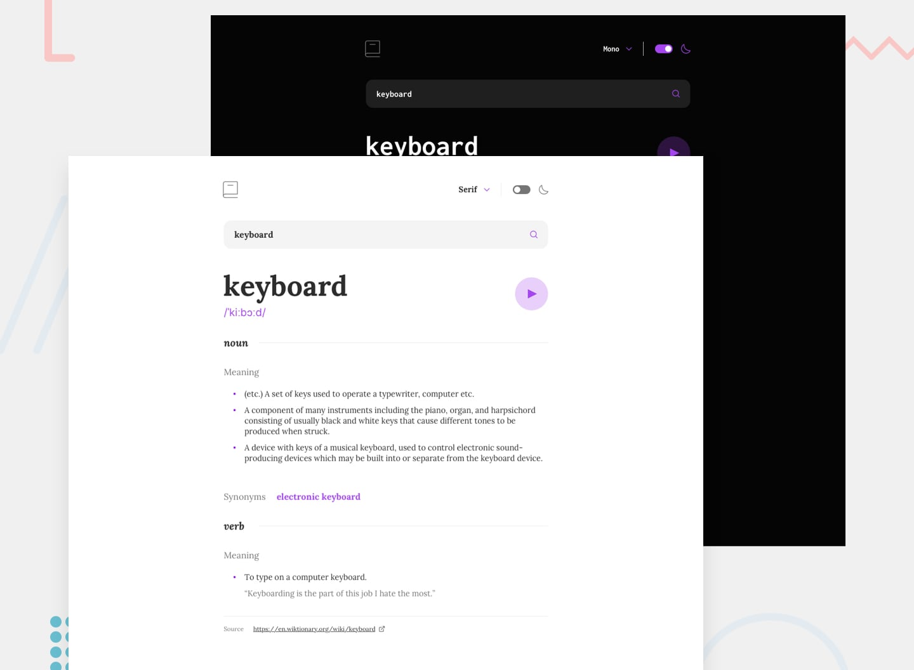

# Frontend Mentor - Dictionary web app solution

## Table of contents

- [Overview](#overview)
  - [The challenge](#the-challenge)
  - [Screenshot](#screenshot)
  - [Links](#links)
  - [Built with](#built-with)
- [Author](#author)

## Overview

### The challenge

Users should be able to:

- Search for words using the input field
- See the Free Dictionary API's response for the searched word
- See a form validation message when trying to submit a blank form
- Play the audio file for a word when it's available
- Switch between serif, sans serif, and monospace fonts
- Switch between light and dark themes
- View the optimal layout for the interface depending on their device's screen size
- See hover and focus states for all interactive elements on the page
- **Bonus**: Have the correct color scheme chosen for them based on their computer preferences. _Hint_: Research `prefers-color-scheme` in CSS.

### Screenshot

### Links

- [Live Site](https://dictionary-web-app-rho-three.vercel.app/)

### Built with

- [Tailwind CSS](https://tailwindcss.com/)
- [Free Dictionary API](https://dictionaryapi.dev/)

## Author

- Frontend Mentor - [makogeboris](https://www.frontendmentor.io/profile/makogeboris)
- Twitter - [makogeboris](https://x.com/makogeboris)
